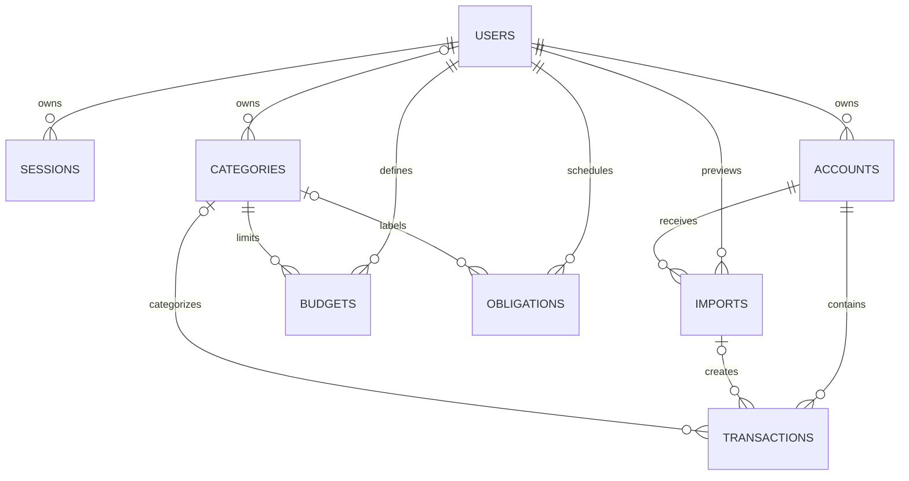
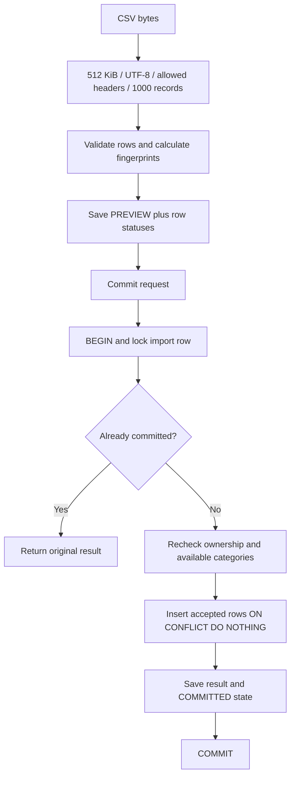

# How RASID is built

RASID uses the repository's NestJS starter and keeps one module per business capability. Controllers translate HTTP; services decide what the operation means; TypeORM repositories handle simple persistence; aggregate queries use parameterized PostgreSQL SQL where the exact query is worth seeing. There is no generic repository wrapper hiding TypeORM and no Strategy layer around five short insight rules.

## Request and ownership boundaries

`main.ts` creates the process. `setup-app.ts` installs the shared request pipeline used by HTTP tests too. Request metadata and body limits run first. The rate limiter and auth guard run before DTO validation. The auth guard verifies the JWT signature, algorithm, issuer, audience, and claim shapes, then verifies that the referenced PostgreSQL session is active. Only then can controllers receive a trusted user ID through `@CurrentUser()`.

The service never takes `userId` from a body. Account queries include both ID and owner. Transaction queries join the owning account and include its owner predicate. A guessed foreign resource ID returns the same 404 as an absent ID. List responses are scoped to the current user. Shared categories have a null owner; private categories are usable only by their owner.

Client DTOs reject unknown fields. PATCH DTOs distinguish omitted fields from explicit null. Null is permitted only for nullable category/reference fields. The account balance and timestamp must be updated together. This prevents silently replacing a stored value with a default while changing an unrelated field.

## Data model

The SQL migration defines the physical schema, foreign keys, uniqueness, checks and indexes. Entity column declarations match the stored types; foreign keys and compound constraints are maintained explicitly in migrations. `synchronize` is always false. Review hand-authored migrations rather than blindly accepting generated schema changes from the deliberately lean entity metadata.

`(account_id, fingerprint)` is unique on transactions; `(account_id, content_hash)` is unique on imports; `(user_id, category_id, month)` is unique on budgets. An import's `(account_id, user_id)` references an owned account pair. A transaction's `(import_id, account_id)` references the same import/account pair. Database constraints remain meaningful even if a future caller bypasses HTTP validation.

## Money and time

`numeric(18,2)` stores money. PostgreSQL returns exact decimal strings; no custom parser turns them into floating point. SQL performs aggregates. TypeScript converts strings into bigint minor units when subtracting, normalizing, or checking thresholds. JSON responses convert them back to decimal strings; bigint itself never crosses JSON.

An expense is a positive amount with `direction=EXPENSE`; an income is a positive amount with `direction=INCOME`. Account balances can be negative. There is no implicit currency conversion. The amount input ceiling is 999,999,999,999.99.

`postedAt` is a calendar date in 2000–2099. A September query is `[September 1, October 1)`, not “30 days ago.” This avoids browser and daylight-saving shifts in booking dates. `balanceAsOf`, session expiry, and creation timestamps are timezone-aware instants. The monthly obligation amount is an estimate shown alongside spending, never added to already-recorded expenses.

## Session rotation

Passwords use Node's asynchronous scrypt with a random salt, a versioned encoding, and constant-time hash comparison. Opaque refresh tokens are random and stored only as SHA-256 hashes. Their session UUID is not the secret. Refresh expiry is absolute (14 days by default); rotation does not extend it indefinitely.

Refresh locks the session row. A valid token is replaced by a new secret. If a token no longer matches, the service saves `revokedAt` and returns a failure marker from the transaction. Only after the transaction commits does it throw 401. Throwing inside that branch would roll back the revocation: the replay test protects this distinction.

Access tokens are short-lived, but logout/revocation is immediate because each authenticated request checks session state. This adds one indexed database lookup per request; the explicit revocation behavior earns that cost in this small system. Refresh uses an HttpOnly, SameSite=Strict cookie and requires `X-RASID-Client: web`. State-changing browser requests reject unapproved origins. Production also requires secure cookies and HTTPS origins.

## CSV transaction boundary

Preview is a report, not a promise that no competing writer will appear. The unique constraint is the final duplicate arbiter. Locking the import makes same-import retries return one committed result; the transaction uniqueness constraint also handles overlapping files. SQL insertion and import status update share the same transaction manager. A failure rolls back both.

Invalid rows require explicit acknowledgment before valid rows are committed. Duplicate rows are skipped and counted. Raw upload bytes are discarded; validated preview records and errors stay in PostgreSQL. That bounded synchronous workflow does not need object storage or a queue.

## Read consistency and tradeoffs

Monthly analytics use a `REPEATABLE READ` transaction so the income, spending, category breakdown and comparison come from one snapshot. Insight computation shares one snapshot with its monthly facts and budgets. Independent HTTP requests can still observe different snapshots: the UI should invalidate related queries after writes.

Offset pagination is explicit and stable within an unchanged dataset: default `postedAt DESC, id DESC`, page 1, limit 20, maximum 100. Concurrent inserts may shift subsequent pages; keyset pagination is a future choice if deep scrolling or large datasets justify it. Literal substring search intentionally avoids a trigram extension until measured traffic needs it.

The implementation follows Nest's [validation](https://docs.nestjs.com/techniques/validation) and [authentication](https://docs.nestjs.com/security/authentication) integration points. The teaching exercises refer to the actual RASID files so these framework concepts can be verified in running requests.
